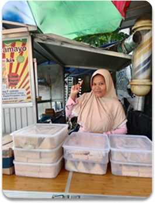

# 📁 SETUP GUIDE - MAMAYO

## ✅ File yang Dibutuhkan

Pastikan Anda memiliki **5 file berikut** dalam 1 folder:

```
mamayo/
├── index.html               ← File HTML (struktur)
├── styles.css               ← File CSS (styling)
├── script.js                ← File JavaScript (interaktivitas)
├── toko.png                 ← Foto toko (PENTING!)
└── README.md                ← Dokumentasi (opsional)
```

---

## 🚀 Cara Setup

### 1. Download Semua File
Download dari folder output:
- ✅ `index.html`
- ✅ `styles.css`
- ✅ `script.js`
- ✅ `toko.png` (Foto toko)
- ✅ `README.md` (Dokumentasi)

### 2. Buat Folder
```
Buat folder baru: "mamayo" atau sesuai nama Anda
```

### 3. Letakkan File
```
Letakkan semua 5 file ke dalam folder yang sama
```

### 4. Buka di Browser
```
Double-click file: index.html
atau
Klik kanan → Buka dengan → Browser
```

---

## 📍 Lokasi File Penting

### index.html
```html
<!-- Link CSS dan JavaScript -->
<link rel="stylesheet" href="styles.css">
<script src="script.js"></script>

<!-- Foto toko -->

```

### styles.css
File ini berisi:
- ✅ Styling umum
- ✅ Warna per halaman
- ✅ Animasi unik per halaman
- ✅ Responsive design

### script.js
File ini berisi:
- ✅ Fungsi navigasi
- ✅ Cart management
- ✅ Payment logic
- ✅ Admin features

### toko.png
- **Ukuran**: 100x100px (akan dipotong otomatis)
- **Format**: PNG, JPG, atau WebP
- **Lokasi**: Sama folder dengan index.html

---

## 🎨 Fitur Unique Per Halaman

### 🏠 HOME
- Dark gradient background
- Photo toko dengan border putih
- Menu dalam grid 2 kolom
- Status toko: BUKA/TUTUP

### 📝 DAFTAR
- Clean white gradient
- Input dengan soft shadow
- Focus state dengan orange glow
- Minimal design

### 🔑 MASUK
- White gradient background
- Remember checkbox interaktif
- "Lupa Password" link
- Divider untuk social login

### 🛒 PESAN
- Orange gradient topbar
- Product rows dengan left border orange
- Quantity buttons interaktif
- Summary dengan gradient background

### 💳 KONFIRMASI
- White clean design
- Dashed border pada summary
- Payment method cards dengan hover lift
- Active state dengan scale effect

### 📱 QR CODE
- Dark mysterious background
- QR box dengan pulsing animation
- Orange gradient amount box
- Timer dengan countdown

### 🏦 TRANSFER
- Colorful bank logos
- Bank tiles dengan lift effect on hover
- Dark gradient header
- Step-by-step instructions

### ✅ SUKSES
- Green gradient background
- Bouncing success icon
- Green gradient button
- Celebratory message

### 👤 PROFIL
- Dark header gradient
- Floating avatar animation
- Menu dengan left border highlight
- Orange active state

### 📋 RIWAYAT
- Orange gradient topbar
- History cards dengan left border
- Status badges (Selesai, Diproses)
- Price display

### ⚙️ ADMIN
- Orange gradient header
- Rotating avatar icon
- Admin menu items
- Professional styling

### 🏪 TOKO
- Orange gradient topbar
- Status toggle switch
- Data table dengan dark header
- Color-coded action buttons (edit/delete)

### ➕ TAMBAH PRODUK
- Orange gradient topbar
- Gradient upload box
- Form inputs dengan orange focus
- File input styled

---

## 🔧 Troubleshooting

### ❌ Foto tidak tampil
**Solusi:**
1. Pastikan file `toko.png` ada di folder yang sama
2. Nama file harus tepat: `toko.png` (case-sensitive)
3. Format: PNG, JPG, atau WebP
4. Ukuran file: < 5MB

### ❌ CSS tidak bekerja
**Solusi:**
1. Pastikan file `styles.css` ada di folder yang sama
2. Check browser console (F12) untuk error
3. Clear browser cache (Ctrl+F5)
4. Nama file harus tepat: `styles.css`

### ❌ JavaScript tidak berfungsi
**Solusi:**
1. Pastikan file `script.js` ada di folder yang sama
2. Check browser console (F12) untuk error
3. Pastikan browser support modern JavaScript
4. Nama file harus tepat: `script.js`

### ❌ Styling burem atau aneh
**Solusi:**
1. Clear browser cache (Ctrl+F5 atau Cmd+Shift+R)
2. Coba buka di browser berbeda
3. Check console untuk CSS error
4. Pastikan Google Fonts terhubung (butuh internet)

---

## 📦 Cara Mengirim Ke Orang Lain

### Opsi 1: Zip File
```
1. Pilih semua file dalam folder
2. Klik kanan → Compress/Zip
3. Kirim file ZIP ke orang lain
4. Mereka extract dan buka index.html
```

### Opsi 2: Cloud Storage
```
1. Upload folder ke Google Drive/Dropbox
2. Share link ke orang lain
3. Mereka download dan ekstrak
4. Buka index.html
```

### Opsi 3: GitHub/Repository
```
1. Push ke GitHub
2. Share repository link
3. Orang lain bisa clone
4. Buka index.html dari file lokal
```

---

## 📱 Preview Mode

Untuk melihat preview lebih baik:

### Desktop
- Ukuran jendela: 420px width (mobile-first design)
- Buka DevTools (F12) → Responsive Design Mode
- Ukuran viewport: 420x800px

### Mobile Device
- Buka file di browser mobile
- Akses via: `file:///path/to/index.html`
- Atau gunakan local server

---

## 🌐 Deploy ke Web (Optional)

### Opsi 1: Netlify (Gratis)
```
1. Pergi ke netlify.com
2. Login dengan GitHub/Email
3. Drag & drop folder "mamayo"
4. Deploy otomatis
5. Dapatkan URL publik
```

### Opsi 2: Vercel (Gratis)
```
1. Pergi ke vercel.com
2. Import project
3. Deploy
4. Dapatkan URL publik
```

### Opsi 3: GitHub Pages (Gratis)
```
1. Push ke GitHub
2. Go to Settings → Pages
3. Select branch & folder
4. Deploy
5. Akses via github.io URL
```

---

## 📝 File Manifest

| File | Size | Deskripsi |
|------|------|-----------|
| index.html | ~65KB | Struktur HTML |
| styles.css | ~50KB | CSS styling |
| script.js | ~10KB | JavaScript logic |
| toko.png | ~200KB | Foto toko |
| README.md | ~5KB | Dokumentasi |
| HALAMAN-STYLING.md | ~15KB | Guide styling |

**Total Size**: ~345KB (tanpa optimization)

---

## 💡 Tips & Tricks

### Untuk Development
```html
<!-- Uncomment untuk debugging -->
<!-- <script>
  console.log('MAMAYO loaded');
</script> -->
```

### Untuk Optimization
```
1. Optimize image: toko.png (compress dengan TinyPNG)
2. Minify CSS: styles.css
3. Minify JS: script.js
4. Enable gzip compression
```

### Untuk Maintenance
```
1. Backup folder setiap hari
2. Version control dengan Git
3. Test di berbagai browser
4. Test di mobile devices
5. Monitor performance
```

---

## 🎯 Next Steps

Setelah setup berhasil:

1. **Customize Warna**
   - Edit `:root` di styles.css
   - Ubah warna per halaman
   - Test di berbagai devices

2. **Tambah Produk**
   - Edit array `products` di script.js
   - Update harga `PRICE`
   - Add product images

3. **Setup Database**
   - Integrate dengan backend
   - Setup authentication
   - Connect payment gateway

4. **Deploy**
   - Upload ke hosting
   - Setup domain
   - Monitor performance

---

## 📞 Support

Jika ada masalah:
1. Check console (F12)
2. Baca README.md
3. Baca HALAMAN-STYLING.md
4. Check file structure
5. Clear cache & reload

---

**Version**: 1.0.0  
**Last Updated**: 2026  
**Status**: Ready to Use ✅

Selamat! Anda sudah siap menggunakan MAMAYO! 🎉
